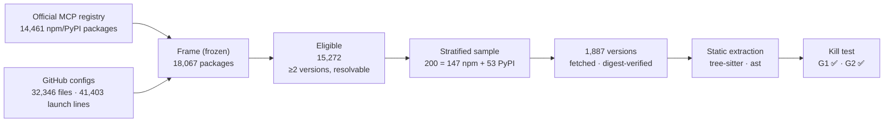

<div align="center">

# 🔒 MCP-Lock

**Provenance-aware pre-install verification for coding agents**

*Pinning what an MCP server is, who built it, and what tools it advertises — before an agent runs it.*


</div>

---

## Why

Coding agents (Claude Code, Cursor, Copilot, Codex) launch MCP servers from config files like
`.mcp.json`, almost always as `npx -y <package>` or `uvx <package>` with **no version pin**. Every
session can silently pull a new release — new code, new maintainer, new install script, and new
**tool descriptions that the model reads as instructions**. Existing pre-install checks look at
package *names* and *sources*; none of them pins **provenance** or **tool definitions**.

MCP-Lock studies how often that drift happens (RQ1), builds a lockfile + gate that catches it (RQ2),
and tests the gate against an attacker who knows its checks (RQ3).

## Research questions

| | Question |
|---|---|
| **RQ1** · census | Among MCP servers launched unpinned via `npx -y` / `uvx`, how often do consecutive package versions change tool definitions, and how often does that coincide with lost provenance, a maintainer change or a new install script? |
| **RQ2** · gate | Do provenance continuity + tool-definition pinning catch more realistic attacks than the Bagmar & Saraf (2026) pre-install hook, and at what false-block rate? |
| **RQ3** · robustness | Does the gate hold against an adaptive attacker who knows its checks? |

## Progress

| Phase | Scope | Status |
|---|---|---|
| 0 | Repo, baseline analysis, sampling plan | ✅ done |
| 1 | Census pilot (200 packages) + kill test | ✅ **PASS** · extractor validated in Docker |
| 2 | Full census + MCP-Lock spec | ⏳ next |
| 3 | Gate (S1–S5) + baseline parity | ⏳ |
| 4 | Pre-registered evaluation | ⏳ |
| 5 | Adaptive attacker + paper | ⏳ |

---

## 📊 Phase 1 results — census pilot (8 Oct 2026)

### Kill test

| Gate | Estimate (Wilson 95% CI) | Weighted (stratified cluster bootstrap) | Threshold | |
|---|---|---|---|---|
| **G1** · versions with extractable tool definitions | **75.8%** · 1,020 / 1,345 · [73.5, 78.0] | 75.9% [69.6, 81.9] | ≥ 60% | ✅ PASS |
| **G2** · packages that changed tools in the last 90 days | **32.5%** · 65 / 200 · [26.4, 39.3] | 32.4% [26.4, 38.4] | ≥ 5% | ✅ PASS |

### Key findings

> **One in three sampled MCP packages changed the tools it advertises in a single 90-day window** —
> and **55.6%** of packages that shipped any release in that window did.

| Measure | Value (Wilson 95% CI) |
|---|---|
| Tool change among packages with a release in the window | 65 / 117 = **55.6%** [46.5, 64.2] |
| Tool change among packages with an extractable window pair | 65 / 92 = **70.7%** [60.7, 79.0] |
| G2 by ecosystem | npm 34.7% [27.5, 42.7] · PyPI 26.4% [16.4, 39.6] |
| G2 excluding pre-releases | 31.5% [25.5, 38.2] |
| G2 counting only name / description changes | 31.0% [25.0, 37.7] |
| Unpinned launch lines in public GitHub configs | npm **93.5%** (34,525 / 36,926) · PyPI **87.6%** (3,921 / 4,477) |
| Versions carrying provenance attestations | npm 31.9% [29.0, 34.9] · PyPI 48.3% [43.2, 53.3] |

**What changed** across 243 tool-change events:

```
description rewritten   ████████████████████████████████  162
schema changed          ███████████████████████           115
tools added             ███████████████████                94
tools removed           ██                                 10
```

**What else changed at the same time** — almost nothing, which is the point: tool drift is a
largely *independent* signal that name/source/provenance checks do not see.

| Co-signal on the same release | Events |
|---|---|
| Publisher account changed (npm) | 8 / 243 = 3.3% [1.7, 6.4] |
| New install script (npm) | 2 / 243 = 0.8% [0.2, 3.0] |
| Provenance lost | 0 / 243 = 0.0% [0.0, 1.6] |

### Extractor validation (Docker `tools/list`, `--network none`)

Static extraction was checked against what 31 live servers actually return from `tools/list`
(GitHub-hosted runner, [workflow](.github/workflows/validate-extractor.yml)).

| | npm (n=20) | PyPI (n=11) | All (n=31) |
|---|---|---|---|
| Tool-name precision | 99.7% | 91.1% | **96.6%** |
| Tool-name recall | 98.4% | 57.5% | **79.1%** |
| Exact tool-name set | 18 / 20 | 6 / 11 | 24 / 31 = 77.4% [60.2, 88.6] |
| Finds ≥ 1 tool when the server has tools | 19 / 20 | 9 / 11 | 28 / 31 = 90.3% [75.1, 96.7] |

Static extraction almost never invents tools and is near-exact on npm; it under-counts on PyPI,
so the G1 and G2 figures above are **conservative lower bounds**. Only 31 of 95 attempted servers
start offline without real credentials, so the validated set leans toward simpler servers.

### Census funnel



<details>
<summary><b>Method details</b></summary>

- **Frame.** F1 = official MCP registry (latest server versions with npm/PyPI packages);
  F2 = GitHub code search over `.mcp.json`, `claude_desktop_config.json`, `.vscode/mcp.json`,
  `.cursor/mcp.json`, partitioned by file size to stay under the 1,000-result cap. The frame was
  hashed and committed before sampling (`sha256 905cc9d7…`).
- **Eligibility.** Resolves on npm/PyPI, ≥ 2 published versions, not a proxy/launcher
  (`mcp-remote`, `@smithery/cli`, …) or a generic script runner (`tsx`, `ts-node`, …).
- **Sample.** Strata = ecosystem × download tercile; ecosystem allocation proportional with a floor
  of 50; `numpy.random.default_rng(20261008)`; estimates weighted back to the frame.
- **Versions.** G1: the 10 most recent versions per package. G2: every version published
  2026-07-10 → 2026-10-08 plus its predecessor (version-precedence order).
- **Extraction.** Never executes package code. JS/TS via tree-sitter (`tool`, `registerTool`,
  `addTool`, `{name, inputSchema}` literals, const resolution across files); Python via `ast`
  (`@x.tool`, `Tool(...)`, enums, Pydantic `model_json_schema`). Unresolvable values become
  `$opaque` and bundler-renamed identifiers are normalized, so rebuilds do not create fake diffs.
- **Audit.** 25 random tool sets and 25 random change events reviewed by hand: 25/25 plausible,
  25/25 genuine edits ([`manual_audit.md`](results/census/pilot/manual_audit.md)).
- **Validation.** Dynamic `tools/list` ground truth: 95 versions attempted in seeded order, 31
  validated, run in Docker with `--network none` on a GitHub-hosted runner
  ([workflow](.github/workflows/validate-extractor.yml)).

</details>

---

## 🧱 Baseline: Bagmar & Saraf (2026)

The baseline is the pre-install hook from *"Setup Complete, Now You Are Compromised"*
(arXiv:2607.15143): a Claude Code `PreToolUse` gate with seven checks on `pip install` /
`uv pip install` (name distance, existence, age, source trust, hidden index, `PIP_CONFIG_FILE`,
OSV). Its code is not public yet, so S1 is reimplemented from the paper in two variants —
**literal** and **charitable** — and RQ2 is reported against the stronger one.

A calibration run shows why both are needed: read literally, the name check flags **52 / 1,000**
top PyPI packages against a top-1,000 popular list, versus **5 / 1,000** reported in the paper
([details](docs/BASELINE_REPLICATION.md)).

## 🔐 The lockfile

Each MCP server entry pins `name@version`, archive integrity, provenance identity (repository,
workflow, builder), publisher, install scripts, and a **tool-definition hash**. Draft schema:
[`lockfile/mcp-lock.schema.json`](lockfile/mcp-lock.schema.json).

| Signal | Detects |
|---|---|
| S1 | Baseline checks (name, existence, age, source, hidden index, config, OSV) |
| S2 | Provenance continuity break |
| S3 | Maintainer / publisher change |
| S4 | New install script |
| S5 | Tool-definition drift |

---

## 🗂 Repository layout

```
census/        RQ1 pipeline: frame, eligibility, sampling, versions, extraction, analysis
lockfile/      MCP-Lock format (JSON schema)
gate/          S1–S5 signals, Claude Code PreToolUse hook, `mcplock check` CLI   (Phase 3)
eval/          attack corpora and scoring                                       (Phase 4)
paper/         IEEEtran manuscript                                              (Phase 5)
results/
  census/      frame, pilot sample, extractions, kill test (+ provenance JSON per result)
  baseline/    S1-only results, kept separate from candidate results
  candidate/   S1–S5 results
docs/          sampling plan, baseline replication notes, citation log
```

## ▶️ Reproduce

```bash
python -m venv .venv && .venv/Scripts/pip install -r requirements.lock   # Python 3.11

python -m census.frame f1                     # official MCP registry
python -m census.frame f2                     # GitHub configs (needs `gh auth login`)
python -m census.frame build
python -m census.meta eligibility results/census/frame/frame_2026-10-08.jsonl
python -m census.meta downloads   results/census/frame/frame_2026-10-08_eligibility.jsonl
python -m census.sample           results/census/frame/frame_2026-10-08_eligible_downloads.jsonl 200
python -m census.versions         results/census/pilot/sample.jsonl
python -m census.run_extract      results/census/pilot/versions.jsonl
python -m census.analyze          results/census/pilot
pytest
```

All HTTP responses are cached under `results/census/cache/` (not committed), so re-runs are
offline and deterministic. Every result file has a sibling `*.provenance.json` with the command,
commit, timestamp and input hashes.

## 🛡 Safety rules

- Nothing is ever published to a public registry; attack scenarios run only against a local Verdaccio.
- Package code is never executed outside Docker with `--network none`; no MCP tool is ever called.
- Public APIs are read-only, rate-limited and cached.
- Any live malicious drift is reported privately to npm/PyPI security before anything else.

## 📚 Related work (verified)

- A. Bagmar, P. Saraf, *Setup Complete, Now You Are Compromised: Weaponizing Setup Instructions Against AI Coding Agents*, arXiv:2607.15143, 2026.
- B. Kapner, C. Soceanu, A. Petrunin, H. Gartner, *Scanning the Harness: Configuration Exposures in AI Coding-Agent Supply Chains*, arXiv:2609.07360v3, 2026 — unpinned MCP declarations in 9.8% of 2,660 setups.

Citation status for every reference is tracked in [`docs/CITATIONS_VERIFIED.md`](docs/CITATIONS_VERIFIED.md).

---

<div align="center">
<sub>Built by <a href="https://github.com/ftaakash">Aakash</a> · B.Tech CSE (Data Science), SRM Institute of Science and Technology</sub>
</div>
